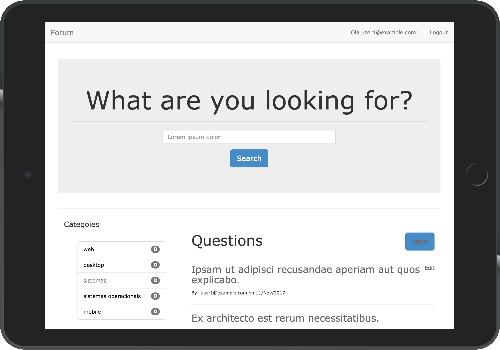

# Forum Rails

Rails Project to study Rails Framework.

- Current Ruby: 2.4.2
- Rails 5.0.6
- Database Default: SQLite3

# Contribution

For contribute for this project, Fork this repository and create a new branch with the following structure `YOURNAME_resume_of_changes`
